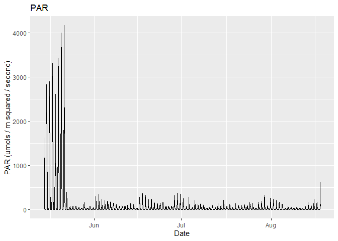
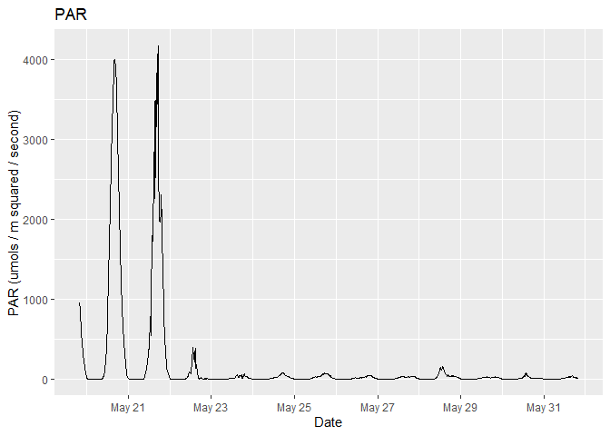
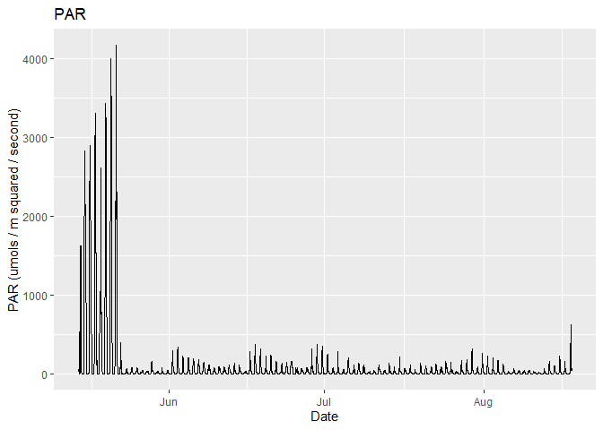

PAR Xtreem
================

## parXtreem

This is for managing and understanding your PAR Odyssey Xtreem data

## Requirements

-   [R v4+](https://www.r-project.org/)
-   [dplyr](https://CRAN.R-project.org/package=dplyr)
-   [readr](https://CRAN.R-project.org/package=readr)
-   [stringr](https://CRAN.R-project.org/package=stringr)
-   [ggplot2](https://CRAN.R-project.org/package=ggplot2)

## Installation

    remotes::install_github("rfrancolini/parXtreem")

## Read Example Data

``` r
library(parXtreem)
x <- read_parXtreem()
x
```

    ## # A tibble: 9,121 x 5
    ##     Temp   PAR ID           logDateTime DateTime           
    ##    <dbl> <dbl> <chr>              <dbl> <dttm>             
    ##  1  7.19 1622. FE23BC74DC01  1621022400 2021-05-14 20:00:00
    ##  2  7.13  739. FE23BC74DC01  1621023300 2021-05-14 20:15:00
    ##  3  7.13  206. FE23BC74DC01  1621024200 2021-05-14 20:30:00
    ##  4  7.19  957. FE23BC74DC01  1621025100 2021-05-14 20:45:00
    ##  5  7.19  443. FE23BC74DC01  1621026000 2021-05-14 21:00:00
    ##  6  7.25  635. FE23BC74DC01  1621026900 2021-05-14 21:15:00
    ##  7  7.25  834. FE23BC74DC01  1621027800 2021-05-14 21:30:00
    ##  8  7.38  695. FE23BC74DC01  1621028700 2021-05-14 21:45:00
    ##  9  7.44  433. FE23BC74DC01  1621029600 2021-05-14 22:00:00
    ## 10  7.5   364. FE23BC74DC01  1621030500 2021-05-14 22:15:00
    ## # ... with 9,111 more rows

## Draw Example Plot

``` r
parplot_x <- draw_plot(x)
parplot_x
```

<!-- -->

## Read Example Data with Defined Start/Stop Dates

``` r
ss <- as.POSIXct(c("2021-05-20", "2021-06-01"), tz = "UTC")
xud <- read_parXtreem(clipped = "user", startstop = ss)
xud
```

    ## # A tibble: 1,153 x 5
    ##     Temp   PAR ID           logDateTime DateTime           
    ##    <dbl> <dbl> <chr>              <dbl> <dttm>             
    ##  1  9.5   955. FE23BC74DC01  1621454400 2021-05-19 20:00:00
    ##  2  9.38  873. FE23BC74DC01  1621455300 2021-05-19 20:15:00
    ##  3  9.31  765. FE23BC74DC01  1621456200 2021-05-19 20:30:00
    ##  4  9.31  666. FE23BC74DC01  1621457100 2021-05-19 20:45:00
    ##  5  8.75  566. FE23BC74DC01  1621458000 2021-05-19 21:00:00
    ##  6  8.31  473  FE23BC74DC01  1621458900 2021-05-19 21:15:00
    ##  7  8     412. FE23BC74DC01  1621459800 2021-05-19 21:30:00
    ##  8  7.81  356. FE23BC74DC01  1621460700 2021-05-19 21:45:00
    ##  9  7.81  297. FE23BC74DC01  1621461600 2021-05-19 22:00:00
    ## 10  7.81  246. FE23BC74DC01  1621462500 2021-05-19 22:15:00
    ## # ... with 1,143 more rows

## Draw Example Plot User Defined Start/Stop Dates

``` r
parplot_xud <- draw_plot(xud)
parplot_xud
```

<!-- -->

## Read Example Data Without Clipping Data

``` r
xna <- read_parXtreem(clipped = "none")
xna
```

    ## # A tibble: 9,166 x 5
    ##     Temp   PAR ID           logDateTime DateTime           
    ##    <dbl> <dbl> <chr>              <dbl> <dttm>             
    ##  1  19.6  20.5 FE23BC74DC01  1620990900 2021-05-14 11:15:00
    ##  2  19.9  81.8 FE23BC74DC01  1620991800 2021-05-14 11:30:00
    ##  3  19.9  79.4 FE23BC74DC01  1620992700 2021-05-14 11:45:00
    ##  4  16.4 535.  FE23BC74DC01  1620993600 2021-05-14 12:00:00
    ##  5  13.1   0   FE23BC74DC01  1620994500 2021-05-14 12:15:00
    ##  6  12    81.4 FE23BC74DC01  1620995400 2021-05-14 12:30:00
    ##  7  13.4  22.7 FE23BC74DC01  1620996300 2021-05-14 12:45:00
    ##  8  13.4  63.6 FE23BC74DC01  1620997200 2021-05-14 13:00:00
    ##  9  13.1  46.9 FE23BC74DC01  1620998100 2021-05-14 13:15:00
    ## 10  13.4  37.8 FE23BC74DC01  1620999000 2021-05-14 13:30:00
    ## # ... with 9,156 more rows

## Draw Example Plot Without Clipping Data

``` r
parplot_na <- draw_plot(xna)
parplot_na
```

<!-- -->
